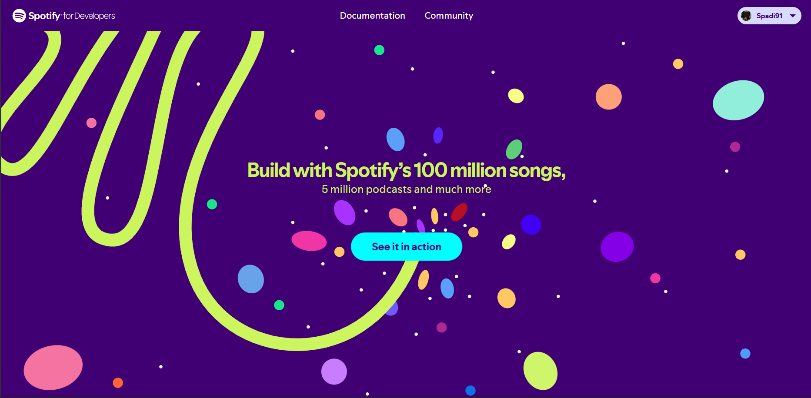
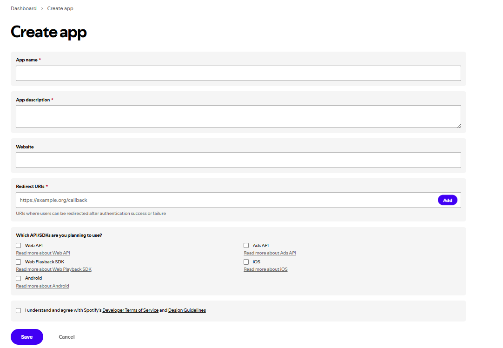
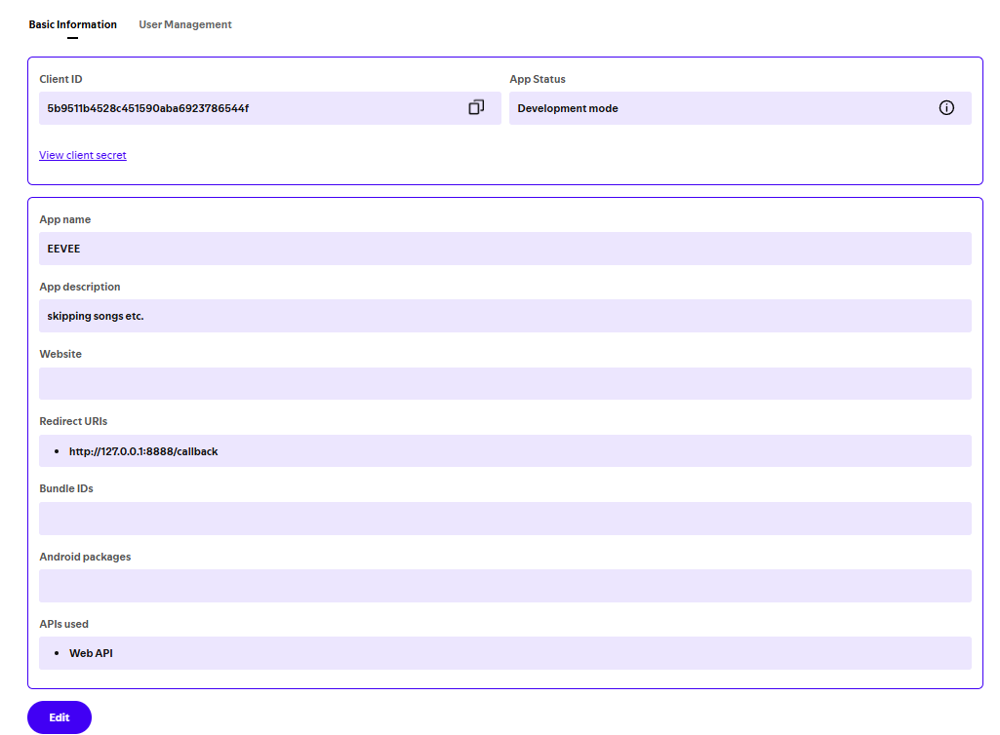

    <h3 align="center">Tutorial<h3\>

    firstly go to this site:
<a href="https://developer.spotify.com" >https://developer.spotify.com</a>

    
    log in, and press create app

    
    fill it accordingly
<ol align="left">
    <li>EEVEE</li>
    <li>for making eevee int</li>
    <li>leave empty</li>
    <li>http://127.0.0.1:8888/callback\n</li>

    now select web API, agree to the TOS
    and guidelines and press save

<h3>now run the get_creds.exe file</h3>

    and anwser the questions
    by filling with
    the content of your
    dashboard
dashboard link:
<a href="https://developer.spotify.com/dashboard/">https://developer.spotify.com/dashboard/</a>

## Spotify.exe

now run the spotify.exe file in the path
dist/spotify.exe

## HOW TO USE

ctrl + shift + [
    
    will open a menu allowing you to:
        play music
        stop music
        next song
        prev song

press again or press ESC to close the menu